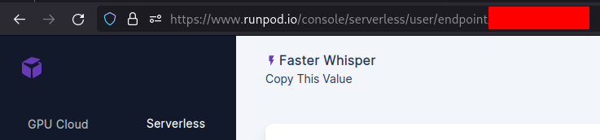

# Yapper

Welcome to the repository for Yapper, a Discord bot created to transcribe Discord voice messages.

## Self Hosting

To run this bot you need to be on at least Node.js `v18.19.0`, then, using corepack (`corepack prepare`) or a system installed pnpm run `pnpm install` to install the bot's dependencies.

Once all dependencies finish installation, please duplicate `.env.example` to `.env.prod` and `.env.dev`, then modify all the values accordingly and do the same for `./prisma/.env`.

This bot uses PostgreSQL! The format for a `DATABASE_URL` is:
```
postgresql://[user[:password]@][host][:port][/dbname]
```

<details>
<summary>Using Runpod</summary>
<br>
You will be asked for an `RUNPOD_API_KEY` and `RUNPOD_ENDPOINT_ID`. 

From the [Runpod Console](https://runpod.io/console), select ["Serverless"](https://www.runpod.io/console/serverless), then ["Quick Deploy"](https://www.runpod.io/console/serverless/quick-deploy) and select "Faster Whisper". Runpod will recommend a 24 GB GPU, this is perfectly fine. However, feel free to switch to the "16 GB GPU".

Your `RUNPOD_ENDPOINT_ID` is under the name "Faster Whisper", or whatever custom name you've provided:


Next, select ["Settings"](https://runpod.io/console/serverless/user/settings), expand "API Keys" and create a new API Key with "Read" permission. Write permission allows this API key to modify your account, which is likely not what you want. This is your `RUNPOD_API_KEY`.
</details>

To run the production version of this bot use `pnpm start`.

To run the development version of this bot use `pnpm build`.

> [!TIP]
> Using development mode will provide you with more detailed logs and push guild commands in the specified `DEVELOPMENT_GUILD_ID` instead of global commands.

If you run into any problems with either [please create an issue](/issues/new).

### Need a Tunnel to Develop Locally?

Follow the instructions here:
https://developers.cloudflare.com/cloudflare-one/connections/connect-networks/get-started/create-local-tunnel

After that's complete, use `pnpm tunnel`!
